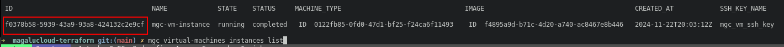
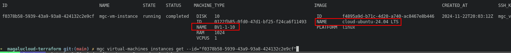
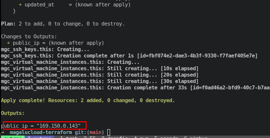
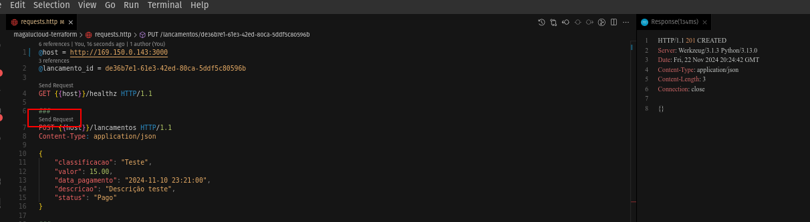
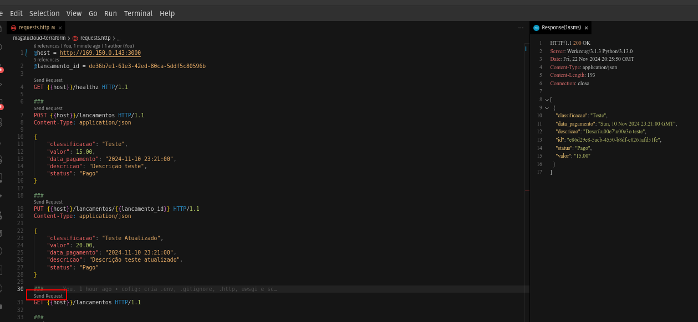

# Magalu Cloud com Terraform

O sistema consiste em uma aplicação em Python e Flask que cadastra lançamentos no banco de dados PostgreSQL. Os containeres serão executada em uma máquina virtual na Magalu Cloud via docker compose. A imagem que será usada já está no [Docker Hub](https://hub.docker.com/r/deirofelippe/magalucloud-terraform).

## Terraform

## Como executar na Magalu Cloud?

Faça o cadastro na [Magalu Cloud](https://magalu.cloud/)

Instale o [CLI](https://docs.magalu.cloud/docs/devops-tools/cli-mgc/overview), vai ser necessário para usar o terraform sem precisar colocar a Api Key e também para listaros recursos pelo teminal.

- Baixe o código `git clone https://github.com/deirofelippe/magalucloud-terraform.git`

- `cd ./magalucloud-terraform`

- Gere a chave SSH: `ssh-keygen -t rsa -b 2048 -f ./mgc_ssh_key -N ""`

Para descobrir quais as `images` e as `machine types` disponíveis, pode ser listado via cli como diz na documentação ([aqui](https://docs.magalu.cloud/docs/computing/virtual-machine/how-to/images/list-images) e [aqui](https://docs.magalu.cloud/docs/computing/virtual-machine/how-to/machine-types/list-machines-types)), mas no momento não estão disponíveis. Uma forma que pode ser visto é criar manualmente a instância pelo site e listar os detalhes pela cli.

- Liste as instâncias (pode copiar pelo site também): `mgc virtual-machines instances list`

  

- Exiba os detalhes da instância: `mgc virtual-machines instances get --id="f0378b58-5939-43a9-93a8-424132c2e9cf"`

  

- `terraform -chdir=./terraform init`

- `terraform -chdir=./terraform plan`

- `terraform -chdir=./terraform apply -auto-approve`

- Copia o IP público gerado.

  

- Cole o IP nos comandos abaixo, trocando pelo `<IP-PÚBLICO>` e execute-os.

- `ssh -i ./mgc_ssh_key ubuntu@<IP-PÚBLICO>`: acesse o servidor para verificar a conexão.

- Faça upload dos arquivos que serão executados no servidor:

  - `rsync -vahz -e 'ssh -i ./mgc_ssh_key -p 22' ./.env ./docker-compose.prod.yaml ubuntu@<IP-PÚBLICO>:/home/ubuntu/scripts`
  - `rsync -vahz -e 'ssh -i ./mgc_ssh_key -p 22' ./scripts ubuntu@<IP-PÚBLICO>:/home/ubuntu`

- Execute o arquivo remotamente que irá instalar o docker e executar o docker compose: `ssh -i ./mgc_ssh_key ubuntu@<IP-PÚBLICO> "bash -c './scripts/config-virtual-machine.sh'"`

- Faça as requisições para testar as rotas, no arquivo `./requests.http` possi o registro.

  

  

- Não esqueça de destruir os recursos criados: `terraform -chdir=./terraform destroy -auto-approve`.
